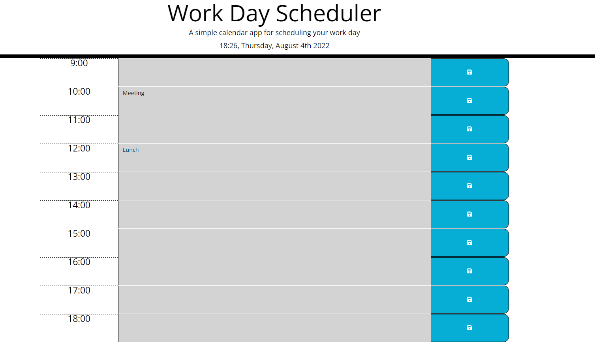

# Work-Day-Scheduler-Inna-s-Challenge-5
My name is Inna Mamedova, I am a student of Birmingham University Coding Bootcamp.
In this challenge I have created a daily planner and gained experience by learning how to use a jQuery.

# Project requirements
Create a simple calendar application using HTML, CSS and jQuery.

# Details
In HTML file I have updated Bootstrap, jQuery and Moment.js links to latest versions.
I have updated the HTML file. I have created time blocks using 'div's' and added to them existing CSS file classes to make application look as intended. 
I have added 'event is saved in local storage' text in HTML file, added style for that text in CSS file and in Java script added function to make a text appear once button save is pressed and disappear after 5 seconds.
Using Moments.js I have added current dated and time to the application page.
In JavaScript file I have added function to compare current time with task time and change time blocks colours depending on if they are in future, present or past.
Also, in JavaScript file I have added function to save the tasks into local storage and make them stay on a page (get from local storage) once page is reloaded.

# Screenshot

# Link

[Web page](https://inna1201.github.io/Work-Day-Scheduler-Inna-s-Challenge-5/)